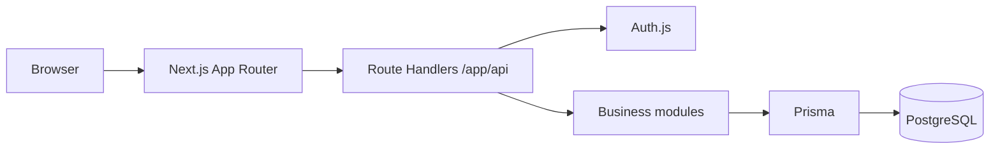
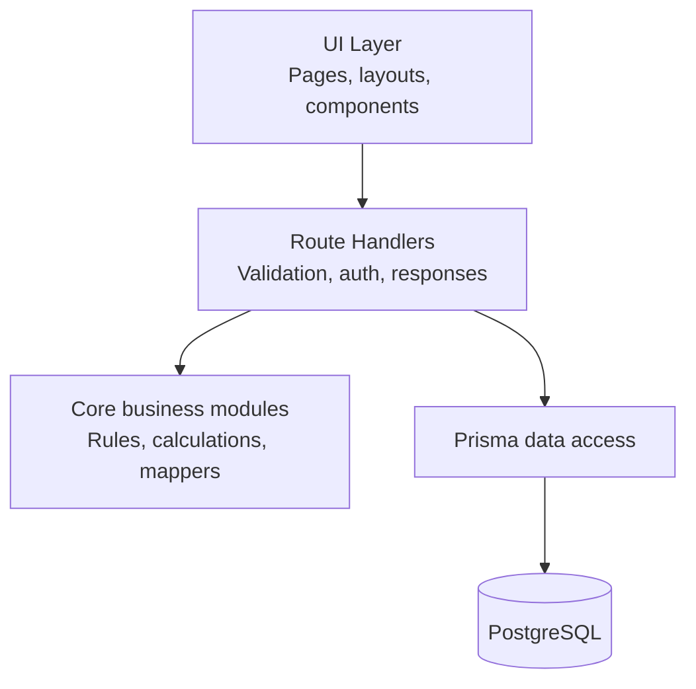

# TempoBase — Architecture

> System architecture for TempoBase.

## 1. Runtime Overview

| Area | Technology | Role |
| --- | --- | --- |
| App runtime | Next.js 16 + React 19 | UI rendering and server execution |
| API layer | App Router Route Handlers | Request validation, orchestration, responses |
| Auth | Auth.js v5 | Credentials auth and session cookies |
| Data access | Prisma 7 | PostgreSQL reads/writes and schema mapping |
| Database | PostgreSQL 16 | Source of truth |
| Deployment target | Vercel + Neon | Zero-cost-friendly hosting baseline |

## 2. Runtime Boundaries

- UI should not contain persistence rules.
- Route Handlers coordinate auth, validation, and response shaping.
- Business rules should stay modular so they can be unit-tested independently.
- Prisma should remain the infrastructure boundary, not the place where product rules accumulate implicitly.

## 3. Architectural Rules

- Prefer same-origin `/api` calls from the frontend.
- Treat Auth.js cookie sessions as the auth model.
- Keep tenant-aware behavior explicit through `accountId` scoping.

## 4. Related Documents

- [02-database.md](02-database.md) — Database model and Prisma conventions
- [03-api-design.md](03-api-design.md) — Route Handler contracts and auth model
- [04-frontend.md](04-frontend.md) — App Router structure and UI conventions
- [09-testing.md](09-testing.md) — Testing strategy
- [11-ai-agent-workflow.md](11-ai-agent-workflow.md) — Agent execution rules
