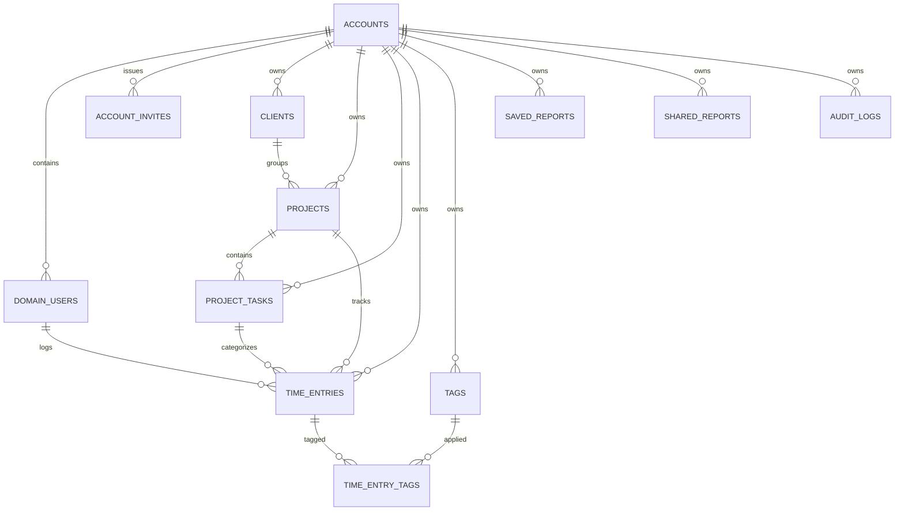

# TempoBase — Database Design

> Persistence design using Prisma and PostgreSQL.

## 1. Primary Store

| Store | Purpose | Technology | Notes |
| --- | --- | --- | --- |
| Primary relational database | All TempoBase transactional data | PostgreSQL 16 | Used by Prisma |
| Local development database | Developer workflow | PostgreSQL via Docker Compose | Same schema shape |
| Preview/production baseline | Managed hosted database | Neon PostgreSQL | Primary deployment target |

## 2. Access Model

- All database access goes through Prisma.
- Tenant scoping is enforced with `accountId` on tenant-owned records.
- Soft delete uses `isDeleted` and `deletedAt` fields where applicable.
- Schema naming follows `snake_case` at the database layer.
- Prisma model names may stay PascalCase while mapping explicitly to `snake_case` tables and columns.

## 3. Current Tables

| Area | Tables / Models |
| --- | --- |
| Tenancy | `accounts`, `domain_users`, `account_invites` |
| Time tracking | `clients`, `projects`, `project_tasks`, `time_entries`, `tags`, `time_entry_tags` |
| Reporting | `saved_reports`, `shared_reports` |
| Audit | `audit_logs` |

## 4. Auth Data Expectations

TempoBase uses Auth.js with JWT session cookies.

- User identity data lives in `domain_users`.
- Password verification depends on stored password hashes.
- The auth model does not require database-backed session tables when using JWT strategy.

## 5. Entity Relationship Overview

## 6. Conventions

| Concern | Rule |
| --- | --- |
| IDs | UUIDs |
| Table naming | `snake_case` via Prisma `@@map` / `@map` |
| Tenant boundary | `account_id` on tenant-scoped records |
| User table | `domain_users` |
| Soft delete | `is_deleted`, `deleted_at` |
| Audit timestamps | `created_at`, `updated_at` |
| Rates / money | decimal / numeric fields with explicit precision |
| Dates | Use PostgreSQL date or timestamptz types intentionally |

## 7. Migration Strategy

- **Production and preview deployments** use `prisma migrate deploy`, which runs automatically during the Vercel build step.
- **Local development** uses `prisma migrate dev --name <description>` to create and apply new migrations.
- Local throwaway environments may use `prisma db push` for fast bootstrapping, but this must never be the path to production.
- Migration files live in `frontend/prisma/migrations/` and must be committed alongside schema changes.
- Existing migration files must never be edited or deleted — the migration history is append-only.
- Schema changes require integration coverage.
- Seed data and test fixtures should come from Prisma helpers or test setup code.

## 8. Related Documents

- [01-architecture.md](01-architecture.md) — Runtime boundaries
- [03-api-design.md](03-api-design.md) — Route Handler contracts and auth model
- [09-testing.md](09-testing.md) — Database-related test expectations
